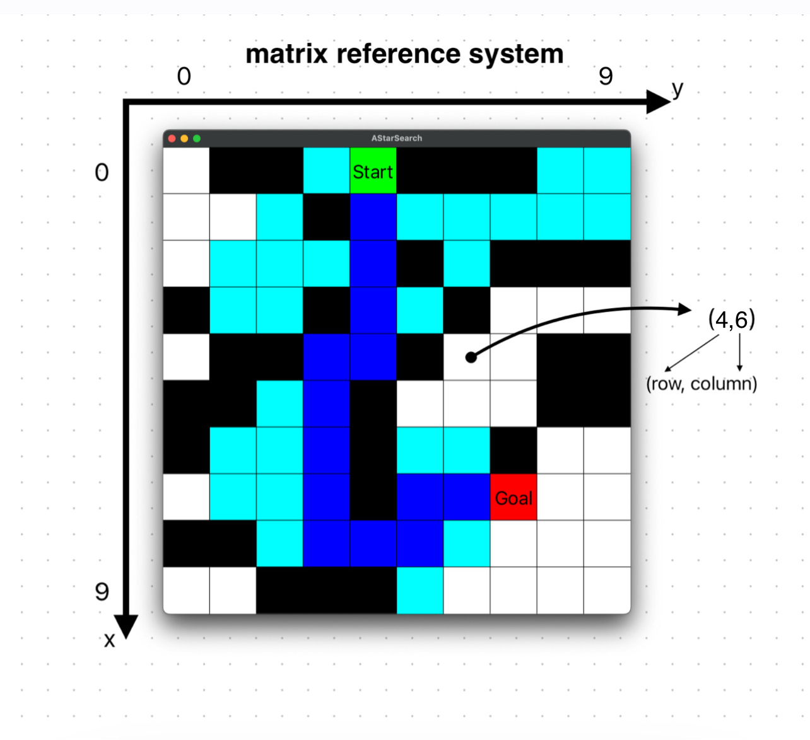
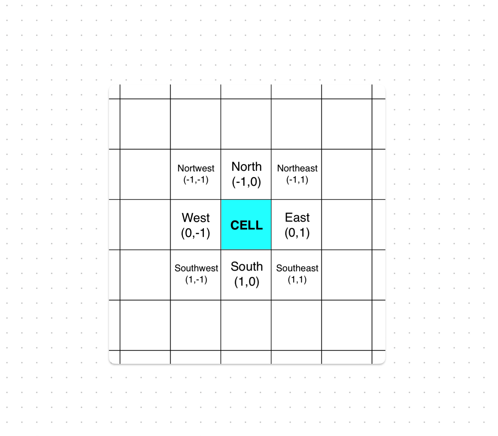

# AStarSearch project

Project for Programming Laboratory @ Unifi - A* Algorithm in a grid (SFML graphics).

## A* Algorithm

The A* (A-Star) Algorithm is an heuristic search algorithm used to find the optimal path between two points in a weighted graph, minimizing the total cost of the path. 
It employs a combination of local evaluations (the actual path cost) and a heuristic estimate (the estimated cost from the current point to the destination point) to select the next move. 
The algorithm efficiently explores the graph, avoiding visiting nodes that would not lead to an optimal solution.

### How does it work:

1. Start with a source node and a destination node.
2. Calculate the actual path cost from the source node to each neighbor.
3. Compute a heuristic estimate of the cost from the current node to the destination node (usually using heuristics like Euclidean distance).
4. Combine the actual cost and heuristic estimate to select the next node to explore.
5. Continue exploring until you reach the destination node or exhaust all possible paths.
6. The optimal path is found when you reach the destination node.

### Typical usage:
    
The A* algorithm is widely used in artificial intelligence, games, robotics, and path planning applications where finding the shortest or optimal path from one point to another in a complex environment is necessary.

### References:

- [Amit’s A* Pages](http://theory.stanford.edu/~amitp/GameProgramming/) <!-- possible description -->
- [Introduction to the A* Algorithm](https://www.redblobgames.com/pathfinding/a-star/introduction.html#graphs) <!-- possible description -->
- [Introduction to A* (old version)](http://theory.stanford.edu/~amitp/GameProgramming/AStarComparison.html) <!-- possible description -->
- [Heuristics](http://theory.stanford.edu/~amitp/GameProgramming/Heuristics.html)
- [Grids and Graphs](https://www.redblobgames.com/pathfinding/grids/graphs.html) <!-- possible description -->
- [Map representations](http://theory.stanford.edu/~amitp/GameProgramming/MapRepresentations.html) <!-- possible description -->
- [Grid parts and relationships](https://www.redblobgames.com/grids/parts/) <!-- possible description -->
- [Grid pathfinding optimizations](https://www.redblobgames.com/pathfinding/grids/algorithms.html) <!-- possible description -->

### Possible ideas for future implementations:

- [Breadth First Search: early exits](https://www.redblobgames.com/pathfinding/early-exit/) <!-- possible description -->
- [Breadth First Search: multiple start points](https://www.redblobgames.com/pathfinding/distance-to-any/) <!-- possible description -->

## Implementation

### Frame of reference

 <!-- TODO -->

<!-- esempio di una cella all'interno della grid (sistema di riferimento matriciale) -->

### Directions

 <!-- TODO -->

<!-- vicini di una cella + directions -->

## Versions

- **Alpha 1.0** - Works correctly for square-size grids with movements in four directions in a square-sized window (no Fullscreen).
- **Beta 1.0** - Works correctly for rectangular grids with movements in four or eight directions (Fullscreen can be enabled).
- **1.0** - Works correctly for rectangular grids with movements in four or eight directions. It has been tested.
- **1.1** - Works correctly for rectangular grids with movements in four or eight directions. It allows to restart the program (right click) generating a new random map, a new random start and a new random goal. It has been tested.
